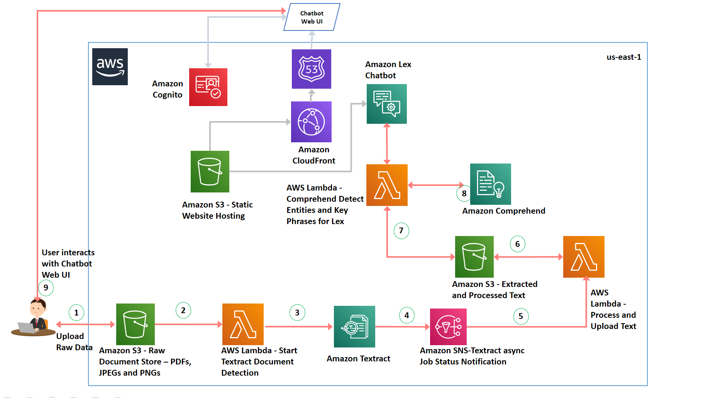

## Deriving Dialogue based Insights from text in Images (JPEG/PNG) or PDF files using Amazon Textract, Amazon Comprehend and an Amazon Lex Chatbot 

Extracting and analyzing text from images or PDFs is a classic machine learning
(ML) and natural language processing (NLP) problem. When extracting the
content from a document, you want to maintain the overall context and store the
information in a readable and searchable format. With AWS’s AI services Amazon
Textract and Amazon Comprehend, it is now easier than ever to setup a
document processing pipeline from ingestion to consumption

This post walks you through setting up a conversational chatbot using Amazon
Lex that enables interaction with insights derived from a text corpus in a PDF
document. Amazon Textract enables intelligent text extraction and Amazon
Comprehend for identifying Named Entities and Key Phrases.

## Services Used
This solution uses AI services, serverless technologies and managed services to
implement a scalable and cost-effective architecture.
* Amazon Textract – Uses ML to extract text and data from scanned
documents in PDF, JPEG or PNG formats.
* Amazon Comprehend – Uses ML to find insights and relationships in text.
* Amazon Lex – Provides an interface to create conversational chatbots.
* Amazon S3 – Object store for your documents and allows for central
management with fine-tuned access controls.
* AWS Lambda – Executes code in response to triggers such as changes in
data, shifts in system state, or user actions. Because S3 can directly trigger
a Lambda function, you can build a variety of real-time serverless data-
processing systems.
* Amazon Cognito - Amazon Cognito lets you add user sign-up, sign-in, and
access control to your web and mobile apps quickly and easily. Amazon
Cognito scales to millions of users and supports sign-in with social identity
providers, such as Facebook, Google, and Amazon, and enterprise identity
providers via SAML 2.0.
* Amazon CodeStar - For setting up the Web UI for the Chatbot, Amazon CodeStar is used to setup a Continuous Delivery pipeline. AWS CodeStar enables you to quickly develop, build, and deploy applications on AWS. AWS CodeStar provides a unified user interface, enabling you to easily manage your software development activities in one place. With AWS CodeStar, you can set up your entire continuous delivery toolchain in minutes, allowing you to start releasing code faster.

## This sample includes:

* README.md - this file

* cfntempalte.yml - this file contains the AWS Serverless Application Model (AWS SAM) used
  by AWS CloudFormation to deploy your application.
  
* AWS Lambda functions writted in Python present in src/Lambda folder for implementing calls to Amazon Textract, Amazon       Comprehend and the fulfillment code for Amazon Lex  

## Solution Overview 

The following diagram illustrates the architecture of the solution

The architecture contains the following steps:

1. Users can use AWS console or the CLI to upload their PDF document to
a S3 bucket
2. Amazon S3 upload triggers a AWS lambda function
3. AWS Lambda invokes an Amazon Textract API, which sets up an
Asynchronous job to detect text from the PDF document uploaded into
Amazon S3 in Step 1
4. Amazon Textract notifies Amazon SNS when text processing is finished.
5. A second AWS Lambda function is attached to the SNS topic that is
triggered as soon a message is received from Amazon Textract
signaling the completion of the job processing.
6. This AWS Lambda function then calls a different Amazon Textract API
to receive the extracted text and loads into an Amazon S3 bucket
7. A third AWS Lambda function that implements the intent for Amazon
Lex reads the processed text and calls an Amazon Comprehend API to
detect entities and key phrases.
8. Amazon Comprehend is a Natural Language Processing Service that uses Machine Learning to find insights and relationships in text. The Lambda function uses boto3 APIs provided by Amazon Comprehend for entity and key phrases detection.
9. The CloudFormation template deploys a Chatbot Web UI to implement a Web based interface for the Amazon Lex Chatbot. The web page is served as a Static Website from an Amazon S3 bucket. The Web UI uses Amazon Cognito for generating an access token for authentication and uses Amazon CodeStar to setup a delivery pipeline. Please refer to this AWS github repo if you need more details on how to setup a Web UI for your Amazon Lex chatbots - https://github.com/aws-samples/aws-lex-web-ui. 

## Deploy 1 click

## License

This project is licensed under the Apache-2.0 License.

