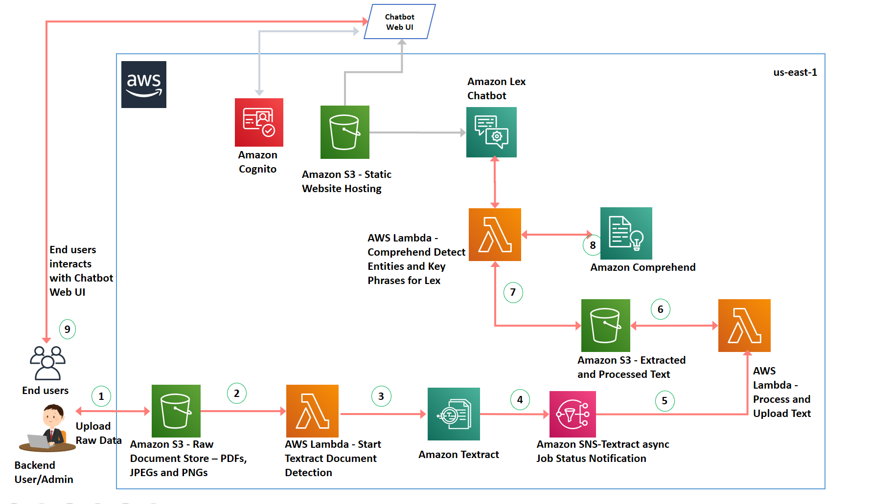

## Create a Chatbot using Amazon Lex to query pdf documents using Amazon Textract with key phrases and entities using Amazon Comprehend

## This sample includes:

* README.md - this file

* cfntempalte.yml - this file contains the AWS Serverless Application Model (AWS SAM) used
  by AWS CloudFormation to deploy your application.

## Architecture Diagram

Architecture below shows the core components. 

## Deploy 1 click

## License

This project is licensed under the Apache-2.0 License.

